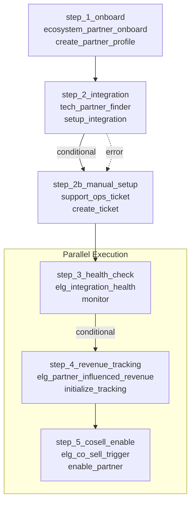

# Workflow: Partner Onboarding to Revenue Tracking

**Version:** 1.0.0

Complete workflow that onboards a new partner, monitors integration health,
and tracks revenue attribution from partner activities.

## Workflow Diagram

## Step Details

### 1. step_1_onboard

- **Skill:** `ecosystem_partner_onboard`
- **Action:** create_partner_profile
- **Timeout:** 60s
- **On Failure:** stop

### 2. step_2_integration

- **Skill:** `tech_partner_finder`
- **Action:** setup_integration
- **Timeout:** 120s
- **On Failure:** fallback

### 3. step_2b_manual_setup

- **Skill:** `support_ops_ticket`
- **Action:** create_ticket
- **On Failure:** continue

### 4. step_3_health_check

- **Skill:** `elg_integration_health`
- **Action:** monitor
- **Timeout:** 90s
- **On Failure:** continue

### 5. step_4_revenue_tracking

- **Skill:** `elg_partner_influenced_revenue`
- **Action:** initialize_tracking
- **Timeout:** 60s
- **On Failure:** retry

### 6. step_5_cosell_enable

- **Skill:** `elg_co_sell_trigger`
- **Action:** enable_partner
- **On Failure:** continue
