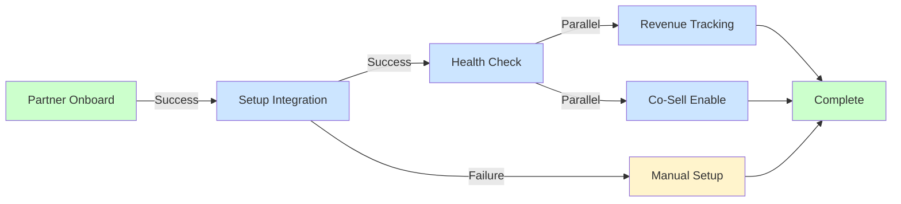

# Skills Directory - Visual Tree

Interactive visualization of the skills directory structure.

```mermaid
graph TD
    Root[Skills Directory<br/>764 Skills]

    Root --> customer_success[Customer Success<br/>61 skills]
    style customer_success fill:#ffcccc
    Root --> data[Data<br/>119 skills]
    style data fill:#ffcccc
    Root --> design[Design<br/>77 skills]
    style design fill:#ffcccc
    Root --> engineering[Engineering<br/>265 skills]
    style engineering fill:#ffcccc
    Root --> executive[Executive<br/>4 skills]
    style executive fill:#ffcccc
    Root --> finance[Finance<br/>13 skills]
    style finance fill:#ffcccc
    Root --> hr[Hr<br/>28 skills]
    style hr fill:#ffcccc
    Root --> legal[Legal<br/>13 skills]
    style legal fill:#ffcccc
    Root --> marketing[Marketing<br/>74 skills]
    style marketing fill:#ffcccc
    Root --> operations[Operations<br/>43 skills]
    style operations fill:#ffcccc
    Root --> product[Product<br/>2 skills]
    style product fill:#ccffcc
    Root --> sales[Sales<br/>47 skills]
    style sales fill:#ffcccc
    Root --> security[Security<br/>18 skills]
    style security fill:#ffcccc

    style Root fill:#e0e0e0,stroke:#333,stroke-width:3px
```

## Color Legend

- 🔴 **Red:** Contains Critical risk skills
- 🟡 **Yellow:** Primarily High risk skills
- 🔵 **Blue:** Mixed risk levels
- 🟢 **Green:** Primarily Low risk skills

## Example Workflow Chain

---

[← Back to Directory](directory.md)

